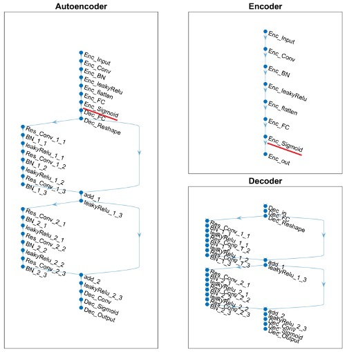

# CsiNet Quantization Method

## Motivation
Since the user must convert the codeword into binary, it can be sent back to the base station. So for the convenience of coding, a Sigmoid activation function will be added after the Encoder's fully-connected layer output to limit the Encoder's output between 0 and 1. However, the performance of using sigmoid as activation function is not good enough, so I discussed the difference between sigmoid and tanh activation function at the following :

1. Sigmoid：0 < codeword < 1
   
   Binary codeword = Quantized(codeword*2-1)

2. tanh：- 1 < codeword < 1
   
   Binary codeword = Quantized(codeword)

## Result
The following are the simulation results of two different activation functions :

|   gamma  |  Method   | Indoor (Sigmoid / Tanh) |             | Outdoor (Sigmoid / Tanh) |             |
|:--------:|:---------:|:-----------------------:|:-----------:|:------------------------:|:-----------:|
|          |           |           NMSE          |     rho     |            NSME          |     rho     |
|    1/4   |  CsiNet   |     -16.24 / -14.30     | 0.99 / 0.98 |       -5.69 / -9.27      | 0.84 / 0.92 |
|   1/16   |  CsiNet   |      -7.90 / -8.68      | 0.93 / 0.93 |       -2.21 / -4.48      | 0.65 / 0.79 |
|   1/32   |  CsiNet   |      -4.83 / -6.15      | 0.87 / 0.88 |       -1.81 / -1.99      | 0.61 / 0.62 |
|   1/64   |  CsiNet   |      -4.35 / -4.90      | 0.81 / 0.84 |       -1.25 / -1.36      | 0.54 / 0.54 |

The following are the simulation results of two different activation functions after we use 1~10 bits to quantized the codeword :

From the above results, we can see that in most scenarios, using tanh for the activation function can bring better results. I think that the corresponding domain of tanh is larger than that of sigmoid, which means that the gradient is also stronger.

## Reference
[1] Huang, Tzu-Hao. "5G downlink channel feedback technology based on deep learning"

[2] MathWorks CSI Feedback with Autoencoders. https://www.mathworks.com/help/5g/ug/csi-feedback-with-autoencoders.html
