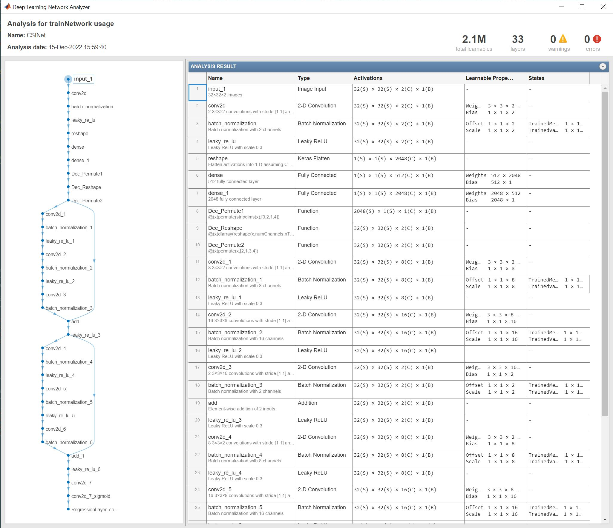
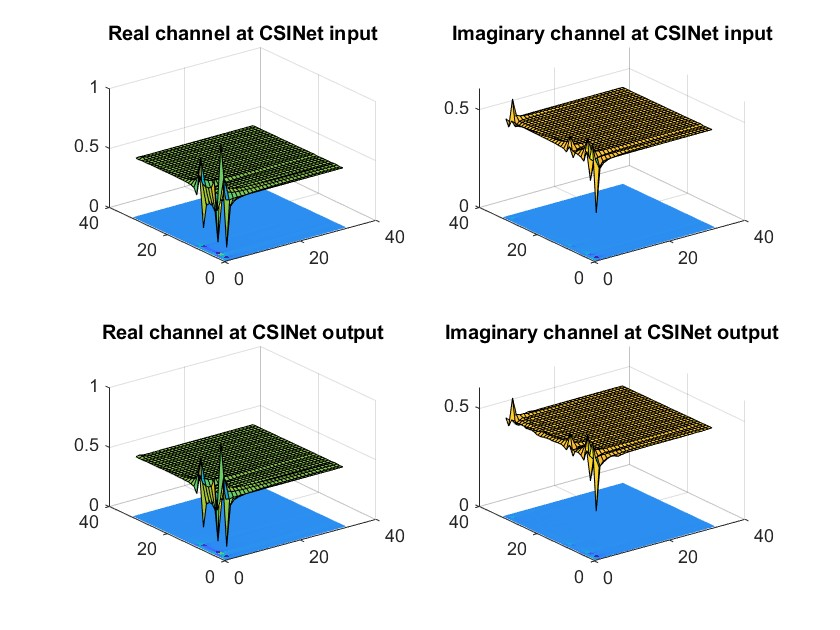
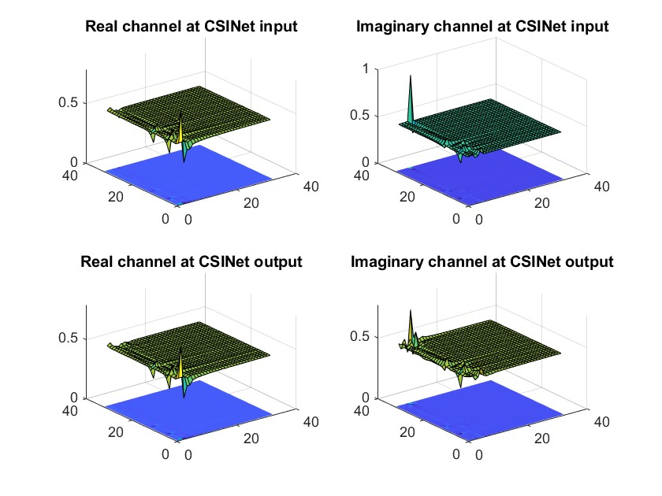

# Code & models for 'Chao-Kai Wen, Wan-Ting Shih, and Shi Jin, "Deep learning for massive MIMO CSI feedback,” IEEE Wireless Communications Letters, 2018, in **channels-last** format.

## Introduction
This directory contains Python® & MATLAB® codes implementing the models described in 
Chao-Kai Wen, Wan-Ting Shih, and Shi Jin, “Deep learning for massive MIMO CSI feedback,” IEEE Wireless Communications Letters, 2018. [Online]. Available: https://ieeexplore.ieee.org/document/8322184/. 
This update is to re-train CsiNet models in **channels_last** format as opposed to the **channels_first** format available in 'saved_model' folder in the root directory of this repo.

The directory contains a re-trained version of CsiNet using **channels_last** format in:
- HDF5 & JSON files (Keras™)
- Tensorflow™ models (Tensorflow)
- MAT files (MATLAB) 

## Requirements
Python:
- Python >=3.9
- Keras (>=2.5.0)
- Tensorflow (>=2.5.3)

MATLAB:
- [MATLAB](https://www.mathworks.com/products/matlab.html) R2022b or later
- [Deep Learning Toolbox&trade;](https://www.mathworks.com/products/deep-learning.html)

## Reproduction steps

### 1. Models & code files 
This directory contains only CsiNet models in channels_last fromat (CS-CsiNet models are only available in channels_first format). 
The trained models are available in the following sub-directories:
- keras: contains the trained models as HDF5 and JSON files
- tensorflow: contains the trained models as TensorFlow models
- MATLAB: contains the trained models as MAT files

#### Code files:
Python:
- Use "CsiNet_onlytest.py" to reproduce the performance metrics listed in the **Results** section below. The trained Keras models and weights are saved in the folder 'keras'.
- Use "CsiNet_train.py" to re-train the models yourself.

MATLAB:
- Use "CsiNet_test.mlx"(or "CsiNet_testCode.m") to reproduce the performance metrics listed in the **Results** section below. The trained MATLAB models and weights are saved in the folder 'MATLAB'.
- Use "CsiNet_train.mlx"(or "CsiNet_trainCode.m") to re-train the models yourself.
- Use the Network Analyzer App in MATLAB to analyze and view the network structure as shown below.




### 2. Training & testing data
Download the data from https://www.dropbox.com/sh/edla5dodnn2ocwi/AADtPCCALXPOsOwYi_rjv3bda?dl=0. Place the downloaded data as shown below.
```
*.py
*.m
*.mlx
keras/
  *.h5
  *.json
MATLAB/
  *.MAT
tensorflow/
data/
  *.mat
```

## Results
The following table lists the normalized mean square error (NMSE) 
and cosine correlation coefficient (rho) computed according to equations (6)-(7) in 
Chao-Kai Wen, Wan-Ting Shih, and Shi Jin, “Deep learning for massive MIMO CSI feedback,” IEEE Wireless Communications Letters, 2018.

|   gamma  |  Method   | Indoor     |            | Outdoor      |            |
|:--------:|:---------:|:----------:|:----------:|:------------:|:----------:|
|          |           |  NMSE      |     rho    |   NSME       |   rho      |
|    1/4   | CsiNet    | **-21.11** |   **0.99** |  **-10.04**  |  **0.92**  |
|   1/16   | CsiNet    | **-9.17**  |   **0.94** |  **-4.85**   |  **0.80**  |
|   1/32   | CsiNet    | **-8.31**  |   **0.92** |  **-2.85**   |  **0.68**  |
|   1/64   | CsiNet    | **-6.32**  |   **0.87** |  **-2.12**   |  **0.60**  |

The following plots show the real and imaginary components of the channel matrix at the input and output of CSINet trained on the indoor environment dataset at gamma = 1/4.
The test samples with the highest and lowest rho are plotted in the first and second plot, respectively.





## Remarks
1. The training schedule is tuned for different compression rates and channel environments. All the models are trained for a maximum of 1500 epochs with a minibatch size of 500, at the end of the training process, the weights corresponding to the minimum validation loss is returned and saved. The following table provides the learning rate schedule parameters used to train the saved models:

|   gamma  |  Method   | Indoor     |                |                | Outdoor    |                |                |
|:--------:|:---------:|:----------:|:--------------:|:--------------:|:----------:|:--------------:|:--------------:|
|          |           | initial_lr | lr_drop_period | lr_drop_factor | initial_lr | lr_drop_period | lr_drop_factor |
|    1/4   | CsiNet    | 5e-3       |   100          | 0.5            |  5e-3      |  Inf           | 0.1            |
|   1/16   | CsiNet    | 3e-3       |   100          | 0.1            |  4e-3      |  20            | 0.1            |
|   1/32   | CsiNet    | 4e-3       |   Inf          | 0.1            |  2e-3      |  20            | 0.1            |
|   1/64   | CsiNet    | 5e-3       |   200          | 0.1            |  8e-3      |  50            | 0.1            |